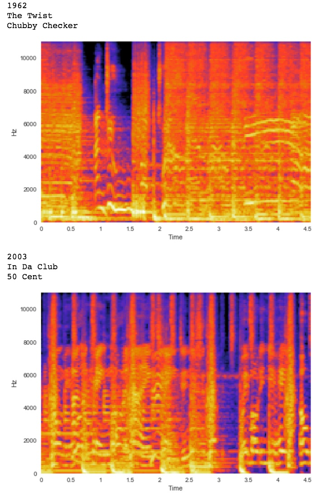

## Pop Music Through the Ages: A CNN Model of Spectrograms

Using a database of mp3s from the Billboard Top 100 charts from 1955 to the present day, I created a model that classified pop songs by decade.  This model used a convolutional neural network trained on the spectrograms obtained from a 5 second clip from the middle of each song.  This model correctly identified the decade of 48% of the songs and correctly identified within one decade of 85% of the songs.  From this model, I was able to make many interesting observations about which decade’s music was the most distinctive, which songs were ahead of their time or reminiscent of earlier times, and which songs were most emblematic of their era.

From this model, I've made some pretty cool insights about pop music through the ages.  Here are a few highlights:

From this model, I've made some pretty cool insights about pop music through the ages. Here are a few highlights:
1960s music was easiest to classify correctly, suggesting it may be the most distinctive music era.
* One song that may be ahead of it's time is: "A Hard Day's Night" by the Beatles (from the 1960s and classified as the 1980s)
* Some songs that were easiest to classify, suggesting they exemplify their era are: "It's Too Late" by Carole King (from the 1970s), "Jack and Diane" by John Mellencamp (from the 1980s)
* One song that feels "retro" is: "So Hard To Say Goodbye" by Boyz 2 Men (from the 1990s and classified as the 1960s)
    
See PopMusicCNN.ipynb for details of implementation.
